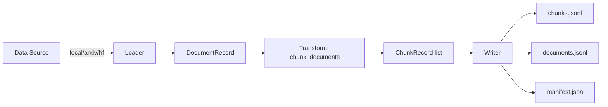
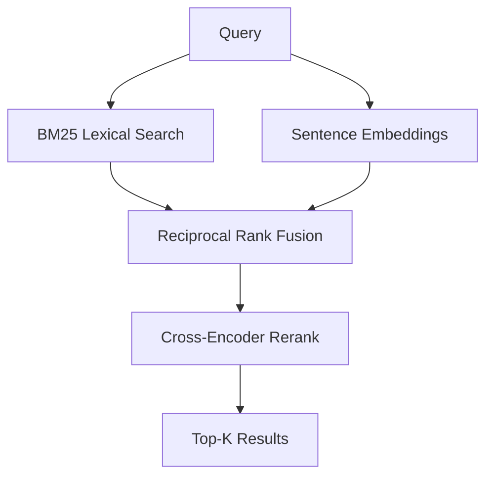
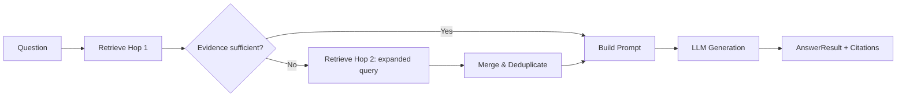
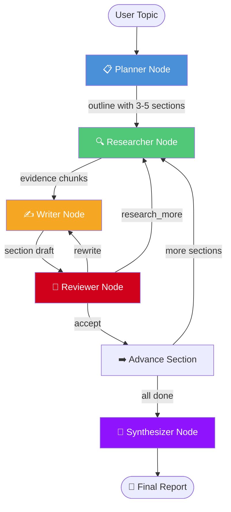
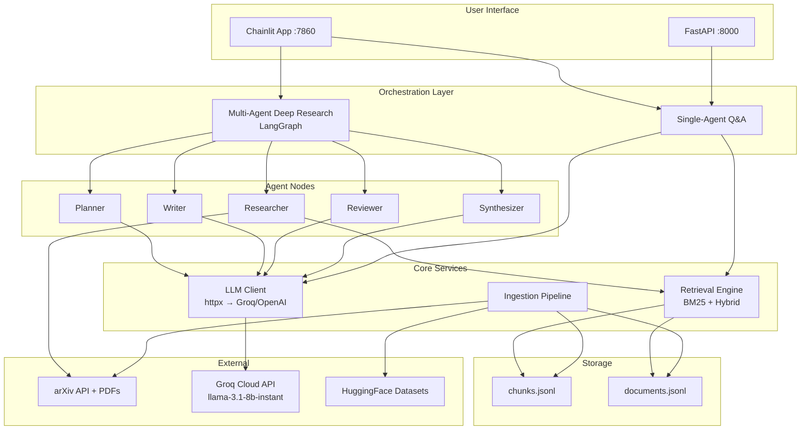

# SciSynth — Project Architecture & System Design

## 1. What is SciSynth?

SciSynth is a **multi-agent research synthesis system** that answers complex academic questions by retrieving evidence from scientific papers and generating cited, grounded answers.

**Two core capabilities:**

| Capability | How it works |
|-----------|-------------|
| **Quick Q&A** (single-agent) | Question → Multi-hop RAG retrieval → LLM → Cited answer |
| **Deep Research** (multi-agent) | Topic → Planner → [Researcher → Writer → Reviewer ↺] × N → Synthesizer → Full report |

**Key differentiators:**
- **Multi-hop RAG**: If the first retrieval doesn't find enough evidence, a second smarter retrieval runs automatically
- **Multi-agent orchestration via LangGraph**: A team of 5 specialized AI agents collaborate in a cyclic graph with quality-control loops
- **Live arXiv integration**: Deep Research fetches real papers from arXiv on-the-fly — no pre-ingested data required
- **Hybrid retrieval**: BM25 (lexical) + sentence embeddings + cross-encoder reranking

---

## 2. Folder Structure

```
scisynth/
├── .env                          # API keys & runtime config (Groq, model, etc.)
├── .env.example                  # Template for .env
├── pyproject.toml                # Python package config, dependencies, entry points
├── chainlit.md                   # Welcome page content for Chainlit UI
├── README.md                     # Project documentation
│
├── config/                       # (reserved for future config files)
├── data/
│   └── processed/
│       └── fixture-v1/           # Ingested demo dataset
│           ├── chunks.jsonl      # Text chunks (the retrieval index)
│           ├── documents.jsonl   # Paper metadata (titles, authors)
│           └── manifest.json     # Ingestion run metadata
│
├── eval/                         # Evaluation framework
│   ├── questions/
│   │   └── frozen_questions.jsonl  # Test question set
│   └── results/                    # Eval output CSVs
│
├── tests/                        # pytest test suite
│
└── src/scisynth/                 # ── MAIN SOURCE CODE ──
    ├── __init__.py
    ├── cli.py                    # CLI entry point (scisynth serve/ingest/eval)
    ├── config.py                 # All settings (Pydantic BaseSettings + .env)
    │
    ├── ingestion/                # ── PHASE 1: DATA INGESTION ──
    │   ├── __init__.py           # Exports run_ingestion()
    │   ├── schema.py             # Data models: DocumentRecord, ChunkRecord
    │   ├── loader.py             # Routes to correct loader (local/arxiv/hf)
    │   ├── arxiv_loader.py       # Batch arXiv ingestion (for `scisynth ingest`)
    │   ├── arxiv_single.py       # Fetch one arXiv paper by URL/ID
    │   ├── arxiv_discovery.py    # Search arXiv by keyword, return papers
    │   ├── arxiv_cache.py        # Cache for arXiv API results
    │   ├── hf_loader.py          # HuggingFace dataset loading (QASPER, SciFact)
    │   ├── pdf_extract.py        # PDF → text extraction via PyMuPDF
    │   ├── transform.py          # Document → chunks (text splitting)
    │   ├── pipeline.py           # Full ingestion orchestrator
    │   ├── writer.py             # Writes chunks.jsonl, documents.jsonl, manifest
    │   ├── raw_snapshot.py       # Optional raw text archival
    │   └── fixtures/v1/          # Built-in demo papers (2 markdown files)
    │
    ├── retrieval/                # ── PHASE 2: RETRIEVAL ENGINE ──
    │   ├── __init__.py           # Exports get_retriever()
    │   ├── contract.py           # Retriever protocol + RetrievedChunk dataclass
    │   ├── factory.py            # Factory: returns Mock or Live retriever
    │   ├── live.py               # LiveRetriever: BM25 + hybrid + cross-encoder
    │   ├── mock.py               # MockRetriever: deterministic test fixtures
    │   ├── memory_bm25.py        # InMemoryBM25Retriever: ephemeral (arXiv/discovery)
    │   ├── chunks_io.py          # Load chunks.jsonl from disk
    │   ├── documents_io.py       # Load paper metadata from disk
    │   ├── ranking.py            # RRF fusion, minmax normalization, argsort
    │   └── text.py               # Tokenizer for BM25
    │
    ├── agent/                    # ── PHASE 3: SINGLE-AGENT Q&A ──
    │   ├── __init__.py           # Exports answer_question(), etc.
    │   ├── service.py            # Main orchestrator: retrieve → prompt → generate
    │   ├── multihop.py           # Multi-hop logic: evidence_insufficient(), hop2 query
    │   ├── prompting.py          # Prompt builder for Q&A answers
    │   ├── llm_client.py         # HTTP client for OpenAI-compatible LLM APIs
    │   └── models.py             # AnswerResult, Citation dataclasses
    │
    ├── research/                 # ── PHASE 4: MULTI-AGENT DEEP RESEARCH ──
    │   ├── __init__.py           # Exports build_research_graph(), stream_research()
    │   ├── state.py              # LangGraph state schema (ResearchState TypedDict)
    │   ├── models.py             # ResearchReport, ReportSection, ResearchCitation
    │   ├── prompts.py            # All agent prompt templates (planner/writer/reviewer/synth)
    │   ├── graph.py              # LangGraph graph builder + routing functions
    │   └── nodes/                # Individual agent node functions
    │       ├── __init__.py
    │       ├── planner.py        # Decomposes topic into outline sections
    │       ├── researcher.py     # RAG retrieval per section (arXiv or index)
    │       ├── writer.py         # Drafts section from evidence
    │       ├── reviewer.py       # Quality check + routing decision
    │       └── synthesizer.py    # Merges sections into final report
    │
    ├── api/                      # ── HTTP API (FastAPI) ──
    │   ├── __init__.py
    │   └── main.py               # /health, /search, /ask, /ask/stream endpoints
    │
    └── ui/                       # ── USER INTERFACE ──
        ├── __init__.py
        ├── chainlit_app.py       # Chainlit chat UI (primary, multi-agent aware)
        └── gradio_app.py         # Gradio UI (legacy, still available)
```

---

## 3. Component Deep-Dives

### 3.1 Configuration ([config.py](file:///c:/Users/galad/Downloads/college/scisynth/src/scisynth/config.py))

Central settings hub using Pydantic `BaseSettings`. Reads from `.env` file at the project root.

Key settings groups:
- **Dataset**: `DATASET_SOURCE`, `DATASET_ID`, `CHUNK_SIZE`, `CHUNK_OVERLAP`
- **LLM**: `LLM_BASE_URL`, `LLM_API_KEY`, `LLM_MODEL`, `LLM_MAX_OUTPUT_TOKENS`
- **RAG**: `RAG_MULTI_HOP`, `RAG_MAX_HOPS`, `RAG_EVIDENCE_MIN_CHUNKS`
- **Retrieval**: `RETRIEVAL_PIPELINE` (bm25/hybrid), reranker config
- **Research**: `RESEARCH_MAX_SECTIONS`, `RESEARCH_MAX_REVIEW_ITERATIONS`

### 3.2 Ingestion Pipeline



- **Loader** selects source: local markdown/PDF files, arXiv API, or HuggingFace datasets
- **Transform** splits documents into overlapping chunks (default 800 chars, 120 overlap)
- **Writer** persists to `data/processed/<dataset_id>/`
- **PDF extraction** via PyMuPDF — handles full arXiv PDFs

### 3.3 Retrieval Engine



Three retriever implementations:
| Retriever | When used | How it works |
|-----------|-----------|-------------|
| **LiveRetriever** | Normal Q&A with ingested data | BM25 + optional hybrid (embeddings + cross-encoder) over `chunks.jsonl` |
| **InMemoryBM25Retriever** | arXiv single paper & discovery | Builds ephemeral BM25 index from freshly chunked papers |
| **MockRetriever** | Tests | Returns deterministic fixture chunks |

### 3.4 Agent — Single Q&A ([agent/service.py](file:///c:/Users/galad/Downloads/college/scisynth/src/scisynth/agent/service.py))

The original pipeline (still used for Quick Q&A, `/arxiv`, `/discover`):



**Multi-hop trigger conditions** (any one triggers hop 2):
- Fewer than `RAG_EVIDENCE_MIN_CHUNKS` chunks returned
- Best chunk score below `RAG_EVIDENCE_MIN_MAX_SCORE`
- Mean chunk score below `RAG_EVIDENCE_MIN_MEAN_SCORE`

### 3.5 Research — Multi-Agent Pipeline ([research/](file:///c:/Users/galad/Downloads/college/scisynth/src/scisynth/research/))

This is the new **LangGraph-orchestrated** multi-agent system:



**State management:** `ResearchState` (TypedDict) flows through the graph. Each node reads what it needs and returns partial updates. Dict fields use custom merge reducers.

**Node details:**

| Node | Input | LLM Call? | Output |
|------|-------|-----------|--------|
| **Planner** | topic | Yes — asks for JSON outline | `outline: [{title, description, queries}]` |
| **Researcher** | section queries | No — uses retrieval engine | `section_evidence: {idx: [chunks]}` |
| **Writer** | outline + evidence | Yes — drafts with citations | `section_drafts: {idx: "text"}` |
| **Reviewer** | draft + evidence | Yes — evaluates quality | `section_reviews: {idx: {action}}` |
| **Synthesizer** | all drafts | Yes — merges into report | `final_report: "markdown text"` |

**Routing logic:**
- Reviewer returns `action`: `"accept"` → next section, `"research_more"` → back to Researcher, `"rewrite"` → back to Writer
- Max iterations guard prevents infinite loops (default: 2 iterations per section)
- After all sections: Synthesizer merges everything

### 3.6 LLM Client ([agent/llm_client.py](file:///c:/Users/galad/Downloads/college/scisynth/src/scisynth/agent/llm_client.py))

Raw HTTP client using `httpx` to call any OpenAI-compatible API:
- Supports **Groq**, **OpenAI**, **Ollama**, **vLLM**, any `/v1/chat/completions` endpoint
- Retry logic with exponential backoff for 429/502/503/504
- Streaming support via SSE for real-time token output
- Used by both single-agent Q&A and all multi-agent research nodes

### 3.7 API Layer ([api/main.py](file:///c:/Users/galad/Downloads/college/scisynth/src/scisynth/api/main.py))

FastAPI server with:
- `GET /health` — liveness + dependency checks
- `GET /search?q=...` — raw retrieval results
- `POST /ask` — full Q&A pipeline (indexed / arXiv / discovery)
- `POST /ask/stream` — SSE streaming version
- Rate limiting middleware (sliding window per IP)
- Request ID tracking (`X-Request-ID` header)

### 3.8 UI — Chainlit ([ui/chainlit_app.py](file:///c:/Users/galad/Downloads/college/scisynth/src/scisynth/ui/chainlit_app.py))

Chat-based interface with:
- Command routing (`/research`, `/research-index`, `/arxiv`, `/discover`, or plain question)
- Real-time step-by-step progress for Deep Research using `cl.Step`
- Async-to-sync bridge: LangGraph runs in a thread via `asyncio.to_thread`, progress events polled and displayed in real time
- Rich markdown rendering for reports and citations

---

## 4. System Architecture Overview



---

## 5. Technology Stack

| Layer | Technology | Purpose |
|-------|-----------|---------|
| Language | Python 3.11+ | Core runtime |
| Orchestration | **LangGraph** | Cyclic multi-agent graph with conditional routing |
| Abstractions | **LangChain Core** | State management, graph primitives |
| LLM | **Groq API** (llama-3.1-8b-instant) | All text generation via OpenAI-compatible protocol |
| HTTP Client | **httpx** | LLM API calls with retry + streaming |
| Retrieval | **rank-bm25** | Lexical BM25 search |
| Semantic (optional) | **sentence-transformers** | Embeddings + cross-encoder reranking |
| API | **FastAPI + Uvicorn** | REST API with SSE streaming |
| UI | **Chainlit** | Real-time chat interface with step tracking |
| PDF | **PyMuPDF** | Extract text from arXiv PDFs |
| Papers | **arxiv** (Python lib) | Fetch papers from arXiv API |
| Config | **pydantic-settings** | Type-safe settings from `.env` |

---

## 6. End-to-End Example Workflow

### User Input
```
/research How do retrieval-augmented generation systems improve scientific question answering?
```

### Step-by-step trace through every component:

---

#### Step 1: Chainlit UI receives the message
**File:** [chainlit_app.py](file:///c:/Users/galad/Downloads/college/scisynth/src/scisynth/ui/chainlit_app.py)

```
on_message() →  detects "/research " prefix
             →  calls _handle_deep_research(topic, source="arxiv")
             →  displays header: "🔬 Deep Research: ..."
             →  starts LangGraph in a background thread
```

#### Step 2: LangGraph initializes the state
**File:** [state.py](file:///c:/Users/galad/Downloads/college/scisynth/src/scisynth/research/state.py)

```python
ResearchState = {
    topic: "How do retrieval-augmented generation systems improve scientific QA?",
    outline: [],
    current_section_idx: 0,
    section_evidence: {},
    section_drafts: {},
    section_reviews: {},
    final_report: "",
    iteration_count: 0,
    max_iterations: 2,
    research_source: "arxiv",
}
```

#### Step 3: Graph starts → Planner Node runs
**File:** [planner.py](file:///c:/Users/galad/Downloads/college/scisynth/src/scisynth/research/nodes/planner.py)

1. Builds planner prompt: *"Break this topic into 5 focused sections..."*
2. Calls LLM (via [llm_client.py](file:///c:/Users/galad/Downloads/college/scisynth/src/scisynth/agent/llm_client.py)) → POST to `https://api.groq.com/openai/v1/chat/completions`
3. LLM returns JSON:
```json
[
  {"title": "Foundations of RAG", "description": "Core architecture...", "queries": ["retrieval augmented generation architecture", "RAG model design"]},
  {"title": "Dense Retrieval Methods", "description": "DPR and variants...", "queries": ["dense passage retrieval scientific QA"]},
  {"title": "Evidence Fusion Strategies", "description": "How generators use...", "queries": ["evidence fusion language models"]},
  {"title": "Domain Adaptation for Science", "description": "Adapting RAG to...", "queries": ["RAG scientific domain adaptation"]},
  {"title": "Evaluation and Benchmarks", "description": "Measuring RAG quality...", "queries": ["RAG evaluation benchmarks scientific"]}
]
```
4. State update: `{outline: [...5 sections...], current_section_idx: 0}`

**UI shows:** `📋 Planning — Created 5 sections: 1. Foundations of RAG ...`

---

#### Step 4: Researcher Node runs (Section 1)
**File:** [researcher.py](file:///c:/Users/galad/Downloads/college/scisynth/src/scisynth/research/nodes/researcher.py)

1. Reads `outline[0].queries` → `["retrieval augmented generation architecture", "RAG model design"]`
2. Source is `"arxiv"`, so calls `_retrieve_from_arxiv()`:
   - For each query:
     - [arxiv_discovery.py](file:///c:/Users/galad/Downloads/college/scisynth/src/scisynth/ingestion/arxiv_discovery.py) → calls arXiv API search
     - Gets 5 matching papers with abstracts + PDF URLs
     - [pdf_extract.py](file:///c:/Users/galad/Downloads/college/scisynth/src/scisynth/ingestion/pdf_extract.py) → downloads & extracts each PDF
     - [transform.py](file:///c:/Users/galad/Downloads/college/scisynth/src/scisynth/ingestion/transform.py) → chunks the text (800 chars, 120 overlap)
     - [memory_bm25.py](file:///c:/Users/galad/Downloads/college/scisynth/src/scisynth/retrieval/memory_bm25.py) → builds ephemeral BM25 index
     - Retrieves top-K chunks from the ephemeral index
3. Deduplicates chunks across queries, sorts by score
4. State update: `{section_evidence: {"0": [{chunk_id, text, score, paper_id, paper_title}, ...]}}`

**UI shows:** `🔍 Researching — Retrieved 8 evidence chunks for section 1`

---

#### Step 5: Writer Node runs (Section 1)
**File:** [writer.py](file:///c:/Users/galad/Downloads/college/scisynth/src/scisynth/research/nodes/writer.py)

1. Reads outline section + evidence chunks
2. Builds writer prompt: *"Write a detailed section... cite using [chunk_id]..."*
3. Formats evidence: `[arxiv_2005.11401:chunk-3] paper='Retrieval-Augmented Generation' score=0.89 ...`
4. Calls LLM → gets a 2-4 paragraph draft with inline citations
5. State update: `{section_drafts: {"0": "Retrieval-Augmented Generation (RAG) represents a paradigm shift in..."}}`

**UI shows:** `✍️ Writing — Drafted section 1 (1240 chars)`

---

#### Step 6: Reviewer Node runs (Section 1)
**File:** [reviewer.py](file:///c:/Users/galad/Downloads/college/scisynth/src/scisynth/research/nodes/reviewer.py)

1. Reads draft + evidence + section description
2. Builds reviewer prompt: *"Evaluate: Does it address the topic? At least 2 citations? Grounded in evidence?"*
3. Calls LLM → returns JSON:
```json
{"passed": true, "feedback": "Well-structured with 3 citations, covers core architecture", "action": "accept"}
```
4. State update: `{section_reviews: {"0": {passed: true, action: "accept"}}}`

**UI shows:** `🔎 Reviewing — Section 1: accept — Well-structured with 3 citations`

---

#### Step 7: Graph routing decision
**File:** [graph.py](file:///c:/Users/galad/Downloads/college/scisynth/src/scisynth/research/graph.py)

```
_review_router(state) → action is "accept" → route to "advance_section"
```

If the reviewer had returned `"research_more"`, the graph would loop back to the **Researcher** node. If `"rewrite"`, it would loop back to the **Writer** node (with the same evidence).

---

#### Step 8: Advance Section
**File:** [synthesizer.py](file:///c:/Users/galad/Downloads/college/scisynth/src/scisynth/research/nodes/synthesizer.py) (contains `advance_section_node`)

```
current_section_idx: 0 → 1, iteration_count reset to 0
```

```
_sections_router(state) → idx 1 < 5 sections → route to "next_section" → Researcher
```

**UI shows:** `➡️ Advance Section — Moving to section 2`

---

#### Steps 9–20: Repeat for sections 2, 3, 4, 5

Each section goes through: **Researcher → Writer → Reviewer → [loop or advance]**

If the Reviewer rejects a section (e.g., too few citations), the loop runs again:
```
Researcher (section 3) → Writer → Reviewer → "research_more" → Researcher (section 3, with new queries)
→ Writer → Reviewer → "accept" → Advance
```

The `max_iterations` guard (default 2) prevents infinite loops — after 2 rejections, the section is force-accepted.

---

#### Step 21: Synthesizer Node runs
**File:** [synthesizer.py](file:///c:/Users/galad/Downloads/college/scisynth/src/scisynth/research/nodes/synthesizer.py)

1. Collects all 5 section drafts from `section_drafts`
2. Builds synthesizer prompt: *"Merge these into a cohesive report with intro + conclusion..."*
3. Calls LLM → produces final markdown report
4. State update: `{final_report: "## Introduction\n\nRetrieval-Augmented Generation has emerged as a..."}`

**UI shows:** `🧬 Synthesizing — Merging sections into a cohesive report...`

---

#### Step 22: Graph reaches END → Chainlit displays the final report

Back in [chainlit_app.py](file:///c:/Users/galad/Downloads/college/scisynth/src/scisynth/ui/chainlit_app.py), the polling loop detects completion:

```markdown
# 📄 Research Report: How do RAG systems improve scientific QA?

## Introduction
Retrieval-Augmented Generation has emerged as a key paradigm for knowledge-
intensive NLP tasks, particularly in scientific domains...

## Foundations of RAG
RAG combines pre-trained retrieval with seq2seq generation [arxiv_2005.11401:chunk-3].
The retriever component uses Dense Passage Retrieval (DPR) to fetch relevant
passages from a knowledge corpus [arxiv_2005.11401:chunk-5]...

## Dense Retrieval Methods
...

## Evidence Fusion Strategies
...

## Domain Adaptation for Science
...

## Evaluation and Benchmarks
...

## Conclusion
This review identifies several key trends: (1) dense retrieval methods
significantly outperform sparse approaches for scientific QA, (2) evidence
fusion at the token level produces more faithful answers...

---
## 📚 Evidence Sources
- Retrieval-Augmented Generation for Knowledge-Intensive NLP Tasks
- Dense Passage Retrieval for Open-Domain Question Answering
- Longformer: The Long-Document Transformer
- SciBERT: A Pretrained Language Model for Scientific Text
- ...

Generated by SciSynth Deep Research · llama-3.1-8b-instant · 47.3s · 5 sections
```

---

### Total LLM calls in this workflow

| Agent | Calls | Purpose |
|-------|-------|---------|
| Planner | 1 | Generate outline |
| Writer | 5 | One draft per section |
| Reviewer | 5–7 | One review per section (+ retries) |
| Synthesizer | 1 | Merge into report |
| **Total** | **~12–14** | All via Groq API |

### Total time breakdown (approximate)

| Phase | Time |
|-------|------|
| Planning | ~2s |
| Research + Write + Review × 5 sections | ~35s (arXiv fetches + LLM calls) |
| Synthesis | ~3s |
| **Total** | **~40-60s** |
