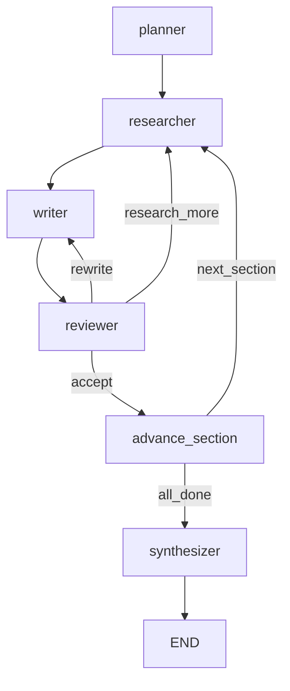
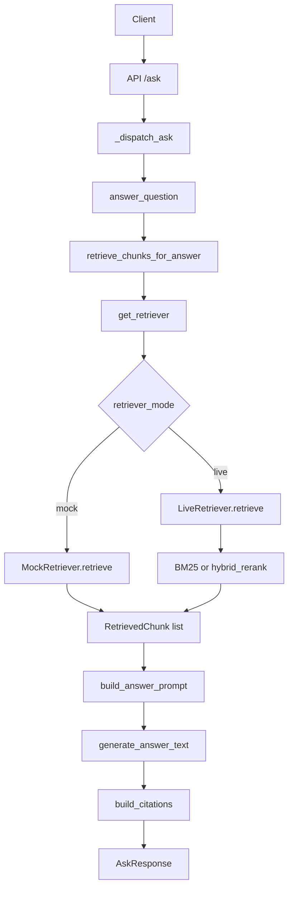

# SciSynth Project Architecture and Workflow

This document describes how the codebase works **as implemented right now**, based on source files in this repository.

## 1) What This Project Does (Runtime Surfaces)

SciSynth is a Python research-assistant system that supports:
- ingestion of documents into a chunk index,
- retrieval over that index (mock or live),
- question answering with citations,
- a deep-research multi-agent report workflow,
- and a frozen evaluation runner.

Primary runtime entry points:
- Console scripts are declared in `pyproject.toml`:
  - `scisynth = scisynth.cli:main`
  - `scisynth-ui = scisynth.ui.chainlit_app:main`
- CLI command router is in `src/scisynth/cli.py` with `serve`, `ingest`, and `eval`.
- API service is in `src/scisynth/api/main.py` (FastAPI app).
- UI app is in `src/scisynth/ui/chainlit_app.py` (Chainlit app).

## 2) Codebase Architecture (Module Responsibilities)

### 2.1 Configuration
- `src/scisynth/config.py`
  - Defines `Settings` (Pydantic settings model).
  - Loads `.env` from repository root using `_DOTENV_PATH`.
  - Exposes `get_settings()` and `reload_settings()`.
  - Houses runtime knobs for retrieval mode/pipeline, RAG multi-hop, deep-research loop limits, API/UI ports, and eval paths.

### 2.2 Ingestion
- `src/scisynth/ingestion/pipeline.py`
  - Orchestrates source resolution -> chunking -> output writing.
  - Source selection: local, arXiv, or HuggingFace via `_resolve_documents`.
- `src/scisynth/ingestion/writer.py`
  - Writes `documents.jsonl`, `chunks.jsonl`, and `manifest.json` into `ingestion_output_path/dataset_id`.
- Related source adapters and transforms are in `src/scisynth/ingestion/*` (e.g., `arxiv_loader.py`, `arxiv_discovery.py`, `transform.py`, `schema.py`).

### 2.3 Retrieval
- `src/scisynth/retrieval/contract.py`
  - Defines public retrieval contract:
    - `Retriever.retrieve(query, top_k)`
    - `RetrievedChunk(id, text, score, paper_id, paper_title)`
- `src/scisynth/retrieval/factory.py`
  - `get_retriever()` returns:
    - `MockRetriever` when `retriever_mode == "mock"`,
    - `LiveRetriever` otherwise.
- `src/scisynth/retrieval/live.py`
  - Loads index artifacts from `chunks.jsonl`/`documents.jsonl`.
  - Supports BM25-only or hybrid retrieval (BM25 + embeddings + optional cross-encoder rerank).
- `src/scisynth/retrieval/mock.py`
  - Returns deterministic fixture chunks.
- `src/scisynth/retrieval/memory_bm25.py`
  - In-memory BM25 retriever used by on-demand arXiv paths.

### 2.4 Agent (Q&A)
- `src/scisynth/agent/service.py`
  - Main orchestration for answer generation (`answer_question`).
  - Multi-hop retrieval is handled by `retrieve_chunks_for_answer`.
  - arXiv-specific answer modes:
    - `answer_question_with_arxiv`
    - `answer_question_with_arxiv_discovery`
  - Citation conversion via `build_citations`.
- `src/scisynth/agent/prompting.py`
  - Prompt construction and retrieval-context formatting.
- `src/scisynth/agent/multihop.py`
  - Evidence sufficiency checks, hop-2 query build, chunk merge logic.
- `src/scisynth/agent/models.py`
  - `AnswerResult`, `Citation`.

### 2.5 Deep Research (Multi-Agent)
- `src/scisynth/research/graph.py`
  - LangGraph topology and routers.
  - Exposes `run_research_sync` and `stream_research`.
- `src/scisynth/research/state.py`
  - `ResearchState` schema and reducer-based dict merges.
- `src/scisynth/research/nodes/*.py`
  - `planner`, `researcher`, `writer`, `reviewer`, `synthesizer`, `advance_section`.
- `src/scisynth/research/prompts.py`
  - Prompt templates and evidence formatting.

### 2.6 API Layer
- `src/scisynth/api/main.py`
  - Endpoints:
    - `GET /health`
    - `GET /search`
    - `POST /ask`
    - `POST /ask/stream`
  - Includes `RateLimitMiddleware` and request-ID middleware.
  - Warmup in lifespan via `get_retriever()`.

### 2.7 UI Layer
- `src/scisynth/ui/chainlit_app.py`
  - Routes commands:
    - plain chat -> quick Q&A
    - `/research` -> deep research graph stream
    - `/arxiv` -> single-paper mode
  - Tracks deep-research progress via incremental message updates.
  - Renders final report + evidence summary.

### 2.8 Evaluation
- `src/scisynth/eval/runner.py`
  - Reads frozen JSONL questions.
  - Calls `answer_question` per item.
  - Writes timestamped CSV in `eval_results_dir`.

## 3) Runtime Request and Command Flows

### 3.1 CLI flow
In `src/scisynth/cli.py`:
- `serve` -> Uvicorn on `scisynth.api.main:app`.
- `ingest` -> `scisynth.ingestion.run_ingestion(...)`.
- `eval` -> `scisynth.eval.run_frozen_eval(...)`.

### 3.2 API ask flow (`POST /ask`)
In `src/scisynth/api/main.py`:
1. Parse `AskRequest`.
2. Dispatch with `_dispatch_ask`:
   - indexed mode -> `answer_question`,
   - `arxiv_url_or_id` -> `answer_question_with_arxiv`,
   - `arxiv_discovery` -> `answer_question_with_arxiv_discovery`.
3. Map `AnswerResult` to `AskResponse`.

### 3.3 API streaming flow (`POST /ask/stream`)
In `src/scisynth/api/main.py`:
- For arXiv modes: produce SSE `meta/token/done` from non-streaming result.
- For indexed mode:
  - call `retrieve_chunks_for_answer`,
  - build prompt,
  - stream tokens with `generate_answer_text_stream`,
  - emit `done` with citations and model.

### 3.4 UI quick and deep flows
In `src/scisynth/ui/chainlit_app.py`:
- `_handle_quick_qa` calls `answer_question`.
- `_handle_arxiv` calls `answer_question_with_arxiv`.
- `_handle_deep_research` runs `stream_research(...)` in executor thread, polls events, updates progress message, then emits final report message.

## 4) Deep Research Agent Workflow (Implemented Behavior)

Source of truth:
- Graph topology and routing: `src/scisynth/research/graph.py`
- State: `src/scisynth/research/state.py`
- Node logic: `src/scisynth/research/nodes/*.py`

### 4.1 Graph topology
Node order:
- `planner -> researcher -> writer -> reviewer`
- reviewer route:
  - `research_more` -> `researcher`
  - `rewrite` -> `writer`
  - `accept` -> `advance_section`
- section route after `advance_section`:
  - `next_section` -> `researcher`
  - `all_done` -> `synthesizer`
- `synthesizer -> END`

### 4.2 State schema and merge behavior
`ResearchState` contains:
- global: `topic`, `outline`, `current_section_idx`, `final_report`,
- per-section dicts: `section_evidence`, `section_drafts`, `section_reviews`,
- loop controls: `iteration_count`, `max_iterations`,
- source selector: `research_source` (`"arxiv"` or `"index"`).

`section_evidence`, `section_drafts`, and `section_reviews` are reducer-merged using `_merge_dicts` in `src/scisynth/research/state.py`.

### 4.3 Node responsibilities
- `planner_node` (`planner.py`)
  - prompts LLM for JSON section plan, validates, fallback to single overview section if parsing fails.
- `researcher_node` (`researcher.py`)
  - resolves section queries, optionally augments with reviewer feedback.
  - source `"index"` -> retrieval factory path.
  - source `"arxiv"` -> arXiv discovery + in-memory BM25; if empty, fallback to index.
  - deduplicates by chunk id, stores chunk dicts in `section_evidence`.
- `writer_node` (`writer.py`)
  - formats section evidence and generates section draft.
- `reviewer_node` (`reviewer.py`)
  - evaluates draft; action in `{accept, research_more, rewrite}`.
  - force-accepts if `iteration_count >= max_iterations`.
  - increments `iteration_count` only when action is not `accept`.
- `advance_section_node` (`synthesizer.py`)
  - increments section index, resets iteration count.
- `synthesizer_node` (`synthesizer.py`)
  - assembles section drafts in outline order.
  - strips duplicate section heading at section start.
  - requests intro/conclusion JSON; uses fallback parsing.
  - writes `final_report`.

### 4.4 Termination conditions
- Per-section review loop terminates on:
  - reviewer action `accept`, or
  - reviewer force-accept after max iterations.
- Whole run terminates when `current_section_idx >= len(outline)` and synthesizer completes.

## 5) Retrieval Pipeline (How Retrieval Happens)

### 5.1 Mode and pipeline configuration
In `src/scisynth/config.py`, retrieval behavior is controlled by:
- `retriever_mode`: `mock` or `live`
- `retrieval_pipeline`: `bm25` or `hybrid`
- hybrid/rerank knobs:
  - `retrieval_candidate_multiplier`
  - `retrieval_embedding_model`
  - `retrieval_cross_encoder_model`
  - `retrieval_reranker`
  - `retrieval_rerank_max_pairs`
- multi-hop controls:
  - `rag_multi_hop`, `rag_max_hops`
  - `rag_hop1_top_k`, `rag_hop2_top_k`
  - `rag_evidence_min_chunks`, `rag_evidence_min_max_score`, `rag_evidence_min_mean_score`

### 5.2 Factory and contract
- Contract: `src/scisynth/retrieval/contract.py`.
- Factory: `src/scisynth/retrieval/factory.py`:
  - mock mode -> `MockRetriever`
  - live mode -> `LiveRetriever`

### 5.3 Live index retrieval
In `src/scisynth/retrieval/live.py`:
1. `_ensure_loaded` reads:
   - `chunks.jsonl` via `retrieval/chunks_io.py`
   - `documents.jsonl` via `retrieval/documents_io.py`
2. builds BM25 index.
3. `retrieve`:
   - always gets BM25 scores first.
   - if hybrid usable, computes semantic similarities and fuses BM25+semantic with RRF.
   - optional cross-encoder rerank for top candidates.
   - normalizes scores and returns `RetrievedChunk` objects.
4. if hybrid requested but semantic stack unavailable, logs warning and falls back to BM25-only behavior.

### 5.4 Mock retrieval
In `src/scisynth/retrieval/mock.py`:
- returns fixed fixture chunks regardless of query.

### 5.5 In-memory BM25 retrieval (on-demand arXiv paths)
In `src/scisynth/retrieval/memory_bm25.py`:
- chunks documents in memory and retrieves with BM25.
- used by:
  - `answer_question_with_arxiv` and
  - `answer_question_with_arxiv_discovery`
  in `src/scisynth/agent/service.py`.

## 6) Data/Object Flow Across Layers

### 6.1 Retrieval objects
`RetrievedChunk` is the retrieval-layer object (contract in `retrieval/contract.py`).

### 6.2 Q&A path transformation
In `src/scisynth/agent/service.py`:
1. `retrieve_chunks_for_answer` returns `list[RetrievedChunk]` + hop count.
2. `build_answer_prompt` (`agent/prompting.py`) formats chunks into prompt context.
3. LLM answer generation returns text.
4. `build_citations` transforms `RetrievedChunk` -> `Citation`.
5. API/UI return `AnswerResult` fields to clients.

### 6.3 Research path transformation
In `src/scisynth/research/nodes/researcher.py`:
- `_chunks_to_dicts` converts `RetrievedChunk` objects into plain dicts stored in `ResearchState.section_evidence`.
- `writer_node` and `reviewer_node` consume those dicts through `format_evidence_for_prompt` in `src/scisynth/research/prompts.py`.

## 7) Ingestion to Retrieval Data Path

The ingest outputs consumed by live retrieval are produced as follows:
1. `run_ingestion` (`src/scisynth/ingestion/pipeline.py`) resolves source and chunks documents.
2. `write_ingestion_outputs` (`src/scisynth/ingestion/writer.py`) writes:
   - `documents.jsonl`
   - `chunks.jsonl`
   - `manifest.json`
3. `LiveRetriever` (`src/scisynth/retrieval/live.py`) reads those files at startup/lazy load.

## 8) Code-Observed Implementation Realities

This section records only repository-observable behavior:
- Streaming path duplication:
  - `answer_question_stream` exists in `src/scisynth/agent/service.py`,
  - `POST /ask/stream` in `src/scisynth/api/main.py` separately implements retrieval/prompt/stream flow.
- UI command behavior:
  - `src/scisynth/ui/chainlit_app.py` routes `/research-index` and `/discover` to a message saying the UI is simplified to three modes.
  - `_handle_discovery` function exists but is not currently reachable from command routing.
- Similar evidence-text cleanup logic exists in:
  - `src/scisynth/agent/prompting.py` (`_clean_pdf_text`) and
  - `src/scisynth/research/prompts.py` (`_clean_evidence_text`).

## 9) Mermaid Diagrams

### 9.1 Deep research graph transitions

### 9.2 Retrieval sequence (indexed /ask path)

## 10) Verification Checklist for Another Agent

Use this list to validate claims quickly:
- Runtime entrypoints/scripts:
  - check `pyproject.toml`, `src/scisynth/cli.py`, `src/scisynth/ui/chainlit_app.py`.
- API contract and routes:
  - inspect `src/scisynth/api/main.py` for `/health`, `/search`, `/ask`, `/ask/stream`.
- Retrieval mode selection:
  - inspect `src/scisynth/retrieval/factory.py` and `src/scisynth/config.py`.
- Live retrieval internals:
  - inspect `src/scisynth/retrieval/live.py` for BM25/hybrid/rerank logic.
- Multi-hop decision criteria:
  - inspect `src/scisynth/agent/multihop.py` and `src/scisynth/agent/service.py`.
- Deep research topology/routing:
  - inspect `src/scisynth/research/graph.py`.
- Deep research state and reducers:
  - inspect `src/scisynth/research/state.py`.
- Node behavior:
  - inspect all files in `src/scisynth/research/nodes/`.
- Ingestion artifact path to retrieval:
  - inspect `src/scisynth/ingestion/pipeline.py`, `src/scisynth/ingestion/writer.py`, and `src/scisynth/retrieval/live.py`.

